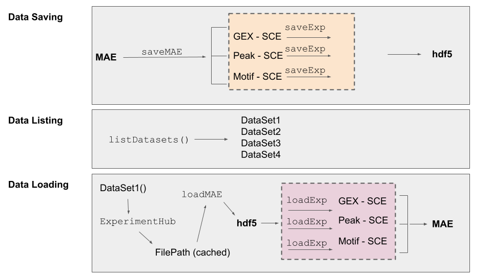

# scMultiome


## Motivation

Single cell data is gaining sophistication - Cells can be measured in multiple modalities including gene expression, chromatin accessibility, cell surface markers and protein expression. These orthogonal measures of the same or matched cells enable a holistic construction of the cell state. However it has been challenging to share multiomic data, especially in an integrated format that consolidates the multiple layers of measurements. The `MultiAssayExperiment` provides a framework to package the various modalities into a single dataset on a per cell basis.

The `scMultiome` package is a collection of public single cell multiome data sets pre-processed and packaged into `MultiAssayExperiment` objects for downstream analysis. It also provides basic functions to save the `MultiAssayExperiment` as `.hdf5` files so that users can load only the desired modalities into memory.


## Data Format

Current multiomic data sets consist of gene expression and chromatin accessibility but can be extended to include any other modalities. The data sets are either paired multiomic data sets or unpaired data sets with data integration performed by the `ArchR` [package](https://www.archrproject.com/). The `ArchR` projects were converted to `MultiAssayExperiment` objects. [MultiAssayExperiment](https://www.bioconductor.org/packages/devel/bioc/vignettes/MultiAssayExperiment/inst/doc/MultiAssayExperiment.html) objects can be constructed easily from individual matrices pre-processed by users' favorite packages.

The `MultiAssayExperiment` object is saved in hdf5 files. The nature of the hdf5 format allows the MAEs to be split into individual experiments and store them in one file, so you can choose freely which ones to load. Experiments, usually `SingleCellExperiment` objects, are disassembled into parts, which are saved in the hdf5 hierarchy. Assays are saved as sparse arrays to save storage.

Upon loading, selected experiments are reassembled and wrapped into an MAE object. Assays are represented by `DelayedMatrix` objects to save memory.

_NOTE: These data sets can be quite large. See `listDatasets()` to avoid surprises._


## Package Contents

To list currently available data sets, use `listDatasets()` or see package help with `?scMultiome`.


## Data Storage and Access

Data sets in `MultiAssayExperiment` form are saved to disk with the `saveMAE` function. It creates an hdf5 file and dispatches individual experiments to `saveExp`. `saveExpe` disassembles and saves experiments to the file.

Each data set is accessed by its own accessor function. Calling an accessor internally queries `ExperimentHub` for the resource, which causes the file to be downloaded and cached. The path to the cached file is passed to `loadMAE`, which in turn calls `loadExp` for each experiment specified in the accessor call. `loadExp` reads experiment components and reassembles them, and then `loadMAE` builds a `MultiAssayExperiment` object. This object is the final return value of the accessor function.




## Installation:
```
if (!require("BiocManager", quietly = TRUE)) install.packages("BiocManager")

BiocManager::install("scMultiome")
```

## Package Structure:

```
.
├── README.md                       this file
├── DESCRIPTION                     package metadata
├── NAMESPACE                       namespace information
├── developer_notes.Rmd             notes for developers
├── R/                              functions
├── man/                            help files
├── vignettes/                      vignettes
├── images/                         images
├── inst/
│   ├── extdata/                    external data, including data set metadata
│   └── scripts/                    scripts, including ones to create data set metadata
└── scMultiome.Rproj                RStudio project file           
```


## Contributing

To add your public data sets to the package, review the vignette _Adding Data Sets_ and contact the package maintainer.

